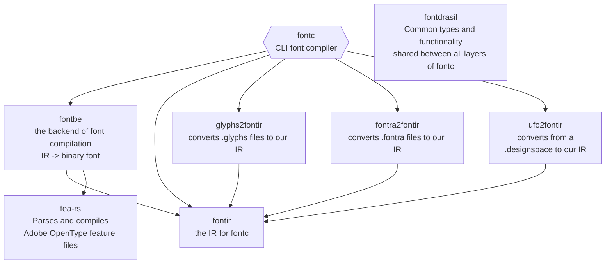

[](https://github.com/googlefonts/fontc/actions/workflows/rust.yml?query=branch%3Amain)
[](https://crates.io/crates/fontc)

# fontc

Wherein we pursue oxidizing [fontmake](https://github.com/googlefonts/fontmake).
For context around where fontmake came from see
[Mr B goes to Vartown](https://github.com/googlefonts/oxidize/blob/main/text/2023-10-18-mrb-goes-to-vartown.md).

Converts source to IR, and then IR to font binary. Aims to be safe and fast.

References

- Intermediate Representation (IR)
  - [Why IR?](https://github.com/googlefonts/oxidize/blob/main/text/2022-11-14-why-ir.md)
  - [IR notes](https://github.com/googlefonts/oxidize/blob/main/text/2022-11-08-font-compiler-ir.md).
- Editor perspective [note from Just](https://github.com/googlefonts/oxidize/issues/21)
- [Units](resources/text/units.md)
  - Fonts have all the best units; distinguishing between them turns out to matter.

## But why?

Two main reasons:

1. Speed
   * The python compiler is too slow and we don't think we can plausibly make it fast enough
1. A key part of Google Fonts technical strategy is to get off both Python and C++, consolidating on Rust
   * Rust enables us to write fast code that integrates well with our serving stack
   * See https://github.com/googlefonts/oxidize

So, Rust compiler time!


(https://xkcd.com/303/ remix)

## Are we there yet?

https://googlefonts.github.io/fontc_crater/ tracks our progress in making the new compiler match the old one.

## Getting started

Install the latest version of Rust, https://www.rust-lang.org/tools/install.

### Build a simple test font

```shell
# Build a .designspace file
$ cargo run -p fontc -- resources/testdata/wght_var.designspace

# Build a .glyphs file
$ cargo run -p fontc -- resources/testdata/glyphs3/WghtVar.glyphs

# Build a .fontra file
$ cargo run -p fontc -- resources/testdata/fontra/minimal.fontra
```

### Emit IR

If you pass the `--emit-ir` option, the IR will be written to disk inside
the build working directory. This can be helpful when troubleshooting.

```shell
$ cargo run -p fontc -- --emit-ir resources/testdata/wght_var.designspace
$ ls build/
```

### Sources to play with

Google Fonts has lots, you could try https://github.com/rsheeter/google_fonts_sources to get some.
Once you have them you could try building them:

```shell
cargo run -p fontc -- ../google_fonts_sources/sources/ofl/notosanskayahli/sources/NotoSansKayahLi.designspace
```

### Building lots of fonts at once

There is an included `fontc_crater` tool that can download and compile multiple
fonts at once; this is used for evaluating the compiler. For more information,
see `fontc_crater/README.md`.

## Plan

We focus on making the compiler better and more robust, ensuring it can handle the full variety of font sources in the Google Fonts ecosystem.

Our progress is tracked via [fontc_crater](https://googlefonts.github.io/fontc_crater/), which compares `fontc` against `fontmake` for thousands of fonts.

Key milestones reached:
- Oswald compilation matches `fontmake`.
- Glyphs integration with the [fontc-export-plugin](https://github.com/googlefonts/fontc-export-plugin).

We are currently:
- Ensuring ever more font families compile correctly and match `fontmake` output (or differ in well-understood ways).
- Moving towards using `fontc` exclusively for all Google Fonts builds.

For context see
https://github.com/googlefonts/oxidize/blob/main/text/2022-07-25-PROPOSAL-build-glyphs-in-rust.md
and the discussion on https://github.com/googlefonts/oxidize/pull/33.

## Using a local copy of fontations

It is quite common to find we need changes in https://github.com/googlefonts/fontations to add a feature
or fix a bug. Prior to a release being available modify the root `Cargo.toml` to point to either a local
clone or a branch:

```toml
# Local copy
[patch.crates-io]
font-types =  { path = "../fontations/font-types" }
read-fonts =  { path = "../fontations/read-fonts" }
write-fonts = { path = "../fontations/write-fonts" }
skrifa =  { path = "../fontations/skrifa" }

# Branch
[patch.crates-io]
font-types = { git="https://github.com/googlefonts/fontations.git", branch="box" }
read-fonts = { git="https://github.com/googlefonts/fontations.git", branch="box" }
write-fonts = { git="https://github.com/googlefonts/fontations.git", branch="box" }
skrifa = { git="https://github.com/googlefonts/fontations.git", branch="box" }
```

## Dependency map

Shows the non-dev dependency relationships among the crates in the repo.


```mermaid
%% This is a map of non-dev font-related dependencies.
%% See https://mermaid.live/edit for a lightweight editing environment for
%% mermaid diagrams.
graph
    %% First we define the nodes and give them short descriptions.
    %% We group them into subgraphs by repo so that the visual layout
    %% maps to the source layout, as this is intended for contributors.

   fontc{{fontc\nCLI font compiler}}
   fontra2fontir[fontra2fontir\nconverts .fontra files to our IR]
   glyphs2fontir[glyphs2fontir\nconverts .glyphs files to our IR]
   ufo2fontir[ufo2fontir\nconverts from a \n.designspace to our IR]
   fontir[fontir\nthe IR for fontc]
   fontbe[fontbe\nthe backend of font compilation\nIR -> binary font]
   fea-rs[fea-rs\nParses and compiles\nAdobe OpenType feature files]
   fontdrasil[fontdrasil\nCommon types and functionality\nshared between all layers of fontc]

    %% Now define the edges.
    %% Made by hand on March 20, 2024, probably not completely correct.
    %% Should be easy to automate if we want to, main thing is to
    %% define the crates of interest.
    fontbe --> fontir
    fontbe --> fea-rs
    fontc --> fontbe
    fontc --> fontir
    fontc --> glyphs2fontir
    fontc --> fontra2fontir
    fontc --> ufo2fontir
    fontra2fontir --> fontir
    glyphs2fontir --> fontir
    ufo2fontir --> fontir
```

## Evaluation & Testing

We use several tools to evaluate the correctness of `fontc` compared to `fontmake`:

*   **[fontc_crater](fontc_crater/README.md)**: A tool for compiling thousands of fonts and generating a [compatibility report](https://googlefonts.github.io/fontc_crater/).
*   **[ttx_diff](ttx_diff/README.md)**: A Python tool for comparing the XML representation of fonts (via `ttx`) produced by `fontc` and `fontmake`.
*   **[otl-normalizer](otl-normalizer/README.md)**: A tool for normalizing OpenType Layout subtables for easier comparison.

## Profiling

For tips on profiling, see [docs/performance.md](docs/performance.md).

## Contributing

We have included a few git hooks that you may choose to use to ensure that
patches will pass CI; these are in `resources/githooks`.

To run the pre-push step manually:

```sh
$ ./resources/githooks/pre-push
```

If you would like to have these run automatically when you commit or push
changes, you can set this as your git hooksPath:

```sh
$ git config core.hooksPath "resources/githooks"
```

## Releasing

See https://github.com/googlefonts/fontations#releasing

To update the Glyphs plugin see <https://github.com/googlefonts/fontc-export-plugin>.
