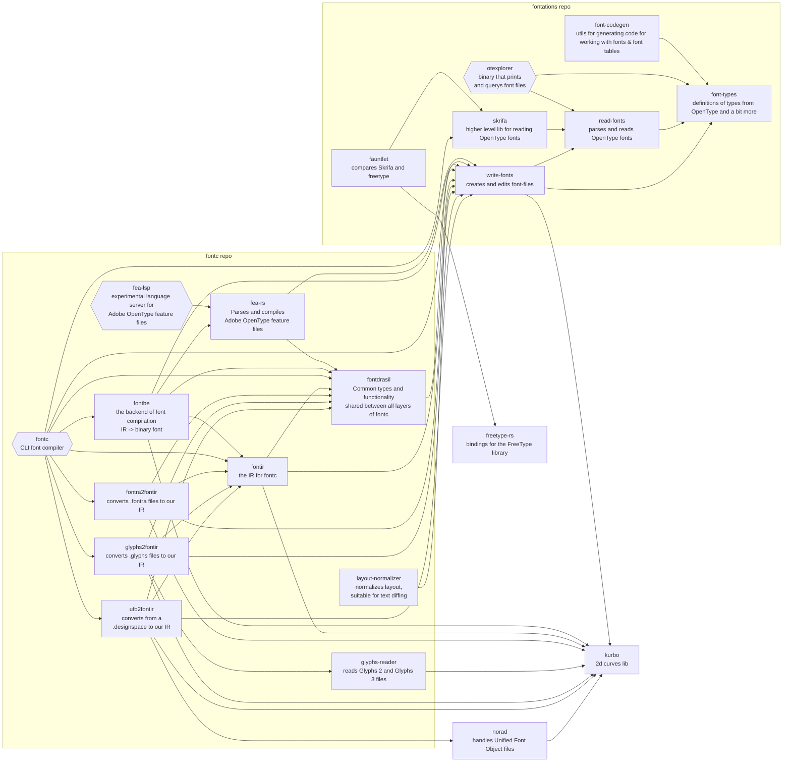

# fontc
Where in we pursue oxidizing (context: https://github.com/googlefonts/oxidize) fontmake. For context
around where fontmake came from see [Mr B goes to Vartown](https://github.com/googlefonts/oxidize/blob/main/text/2023-10-18-mrb-goes-to-vartown.md).

Converts source to IR, and then IR to font binary. Aims to be safe, incremental, and fast.

References

   * Intermediate Representation (IR)
      * [Why IR?](https://github.com/googlefonts/oxidize/blob/main/text/2022-11-14-why-ir.md)
      * [IR notes](https://github.com/googlefonts/oxidize/blob/main/text/2022-11-08-font-compiler-ir.md).
   * Editor perspective [note from Just](https://github.com/googlefonts/oxidize/issues/21)
   * [Units](resources/text/units.md)
      * Fonts have all the best units; distinguishing between them turns out to matter.

## But why?


(https://xkcd.com/303/ remix)

## Getting started

Install the latest version of Rust, https://www.rust-lang.org/tools/install.

### Build a simple test font

```shell
$ cargo run -p fontc -- resources/testdata/wght_var.designspace
```

### Emit IR to enable incremental builds

If you pass the `--incremental` (or `-i`) option, the IR will be written to disk inside
the build working directory, so that the next time you run fontc with the same source file
only what changed will be rebuilt.

```shell
$ cargo run -p fontc -- --incremental resources/testdata/wght_var.designspace
$ ls build/
```

### Sources to play with

Google Fonts has lots, you could try https://github.com/rsheeter/google_fonts_sources to get some.
Once you have them you could try building them:

```shell
cargo run --package fontc -- ../google_fonts_sources/sources/ofl/notosanskayahli/sources/NotoSansKayahLi.designspace
```

## Plan

As of 6/4/2023 we intend to:

* Get to the point where Oswald compilation matches fontmake
   * https://github.com/googlefonts/fontc/milestone/4
* Get to the point where ever more of the families for which we have source compile
  to a form that matches fontmake, or differs only in well understood ways
* Provide a Glyphs plugin to allow push-button use of the new compiler
* Once there are no known issues, switch Google Fonts to exclusively use fontc

We are discarding our prior plan to make fontmake (Python) call into Rust as it appears to be
more complex than initially anticipated and higher risk than migrating on a per-family basis.

For context see https://github.com/googlefonts/oxidize/blob/main/text/2022-07-25-PROPOSAL-build-glyphs-in-rust.md and the discussion on https://github.com/googlefonts/oxidize/pull/33.


## Using a local copy of fontations

It is quite common to find we need changes in https://github.com/googlefonts/fontations to add a feature
or fix a bug. Prior to a release being available modify the root `Cargo.toml` to point to either a local
clone or a branch:

```toml
# Local copy
[patch.crates-io]
font-types =  { path = "../fontations/font-types" }
read-fonts =  { path = "../fontations/read-fonts" }
write-fonts = { path = "../fontations/write-fonts" }
skrifa =  { path = "../fontations/skrifa" }

# Branch
[patch.crates-io]
font-types = { git="https://github.com/googlefonts/fontations.git", branch="box" }
read-fonts = { git="https://github.com/googlefonts/fontations.git", branch="box" }
write-fonts = { git="https://github.com/googlefonts/fontations.git", branch="box" }
skrifa = { git="https://github.com/googlefonts/fontations.git", branch="box" }
```

## Dependency map

Shows the non-dev dependency relationships among the font-related crates in fontations and fontc.



## Comparing branch performance with hyperfine

Only relatively large changes are effectively detected this way:

```shell
# On each branch, typically main and your branch run hyperfine:
$ cargo build --release && hyperfine --warmup 3 --runs 250 --prepare 'rm -rf build/' 'target/release/fontc ../OswaldFont/sources/Oswald.glyphs'

# Ideally mean+σ of the improved branch is < mean-σ for main.
# For example, p2s is probably faster here:
# main Time (mean ± σ):     154.8 ms ±   8.2 ms
# p2s Time (mean ± σ):     132.7 ms ±   6.4 ms

# Report similar to ^ if claiming this as proof your branch is a win.
```

## Running flamegraph

[flamegraphs](https://www.brendangregg.com/flamegraphs.html) of fontc are very handy. They are most
easily created using `cargo flamegraph`:

```shell

# Minimize the impact of logging
$ export RUST_LOG=error
# Symbols are nice, https://github.com/flamegraph-rs/flamegraph#improving-output-when-running-with---release
$ export CARGO_PROFILE_RELEASE_DEBUG=true

# Build something and capture a flamegraph of it
$ rm -rf build/ && cargo flamegraph -p fontc -- ../OswaldFont/sources/Oswald.glyphs

# TIPS

# On macOS you might have to pass `--root` to cargo flamegraph, e.g. cargo flamegraph --root ...as above...

# If you are losing samples you might want to dial down the rayon threadcount
# You'll see a perf error similar to:
Warning:
Processed 5114 events and lost 159 chunks!

Check IO/CPU overload!

Warning:
Processed 5116 samples and lost 35.01%!

# Fix is to lower the threadcount:
$ export RAYON_NUM_THREADS=16
```

### Focused flames

https://blog.anp.lol/rust/2016/07/24/profiling-rust-perf-flamegraph/ offers examples of filtering flamegraphs. This
is very useful when you want to zoom in on a specific operation. For example, to dig into fea-rs:

```shell
# Generate a perf.data
# You can also use perf record but cargo flamegraph seems to have nice capture settings for Rust rigged
$ rm -rf build/ perf.data && cargo flamegraph -p fontc -- ../OswaldFont/sources/Oswald.glyphs

# ^ produced flamegraph.svg but it's very noisy, lets narrow our focus
# Example assumes https://github.com/brendangregg/FlameGraph is cloned in a sibling directory to fontc
$ perf script | ../FlameGraph/stackcollapse-perf.pl | grep fea_rs | ../FlameGraph/flamegraph.pl > fea-flame.svg
```

## Contributing

We have included a few git hooks that you may choose to use to ensure that
patches will pass CI; these are in `resources/githooks`.

To run the pre-push step manually:

```sh
$ ./resources/githooks/pre-push
```

If you would like to have these run automatically when you commit or push
changes, you can set this as your git hooksPath:

```sh
$ git config core.hooksPath "resources/githooks"
```


## Releasing

See https://github.com/googlefonts/fontations#releasing
